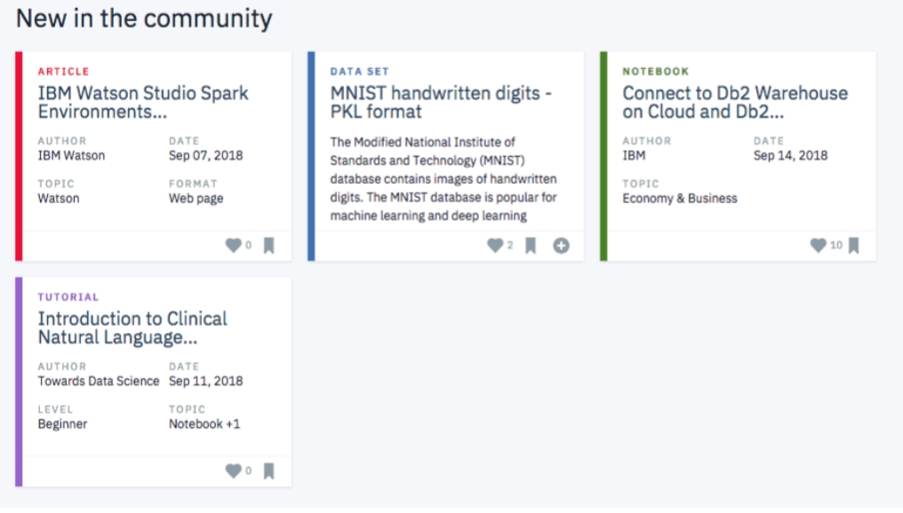

# Recommendations-with-IBM

### Table of Contents
1. [Project Motivation](#motivation)
2. [Implementation](#process)
3. [File Descriptions](#files)
4. [Licensing, Authors, and Acknowledgements](#license)

## Project Motivation

This project is being done as a part of the Udacity Data Scientist Nanodegree Term 2 Project 3. It involves Rank based filtering, Collaborative filtering, and SVD models for recommendations.

In this project, the objective is to analyze the interactions that users have with articles on the IBM Watson Studio platform, and make recommendations to them about new articles you think they will like. Below you can see an example of what the dashboard could look like displaying articles on the IBM Watson Platform.

Though the above dashboard is just showing the newest articles, you could imagine having a recommendation board available here that shows the articles that are most relevant to a specific user.

In order to determine which articles to show to each user, you can create your own account to become a part of their community, and get a better understanding of their data by creating an account on the platform [here](https://dataplatform.cloud.ibm.com/).

## File Descriptions 

## The Process 
The project is divided into the following tasks:

### I. Exploratory Data Analysis

Before making recommendations of any kind, you will need to explore the data you are working with for the project. Dive in to see what you can find. There are some basic, required questions to be answered about the data you are working with throughout the rest of the notebook. Use this space to explore, before you dive into the details of your recommendation system in the later sections.

### II. Rank Based Recommendations

To get started in building recommendations, you will first find the most popular articles simply based on the most interactions. Since there are no ratings for any of the articles, it is easy to assume the articles with the most interactions are the most popular. These are then the articles we might recommend to new users (or anyone depending on what we know about them).

### III. User-User Based Collaborative Filtering

In order to build better recommendations for the users of IBM's platform, we could look at users that are similar in terms of the items they have interacted with. These items could then be recommended to the similar users. This would be a step in the right direction towards more personal recommendations for the users. You will implement this next.

### IV. Content Based Recommendations
Given the amount of content available for each article, there are a number of different ways in which someone might choose to implement a content based recommendations system. Using your NLP skills, you might come up with some extremely creative ways to develop a content based recommendation system. You are encouraged to complete a content based recommendation system, but not required to do so to complete this project.

### V. Matrix Factorization

Finally, you will complete a machine learning approach to building recommendations. Using the user-item interactions, you will build out a matrix decomposition. Using your decomposition, you will get an idea of how well you can predict new articles an individual might interact with (spoiler alert - it isn't great). You will finally discuss which methods you might use moving forward, and how you might test how well your recommendations are working for engaging users.

## Licensing, Authors, Acknowledgements 
This web application was developed as part of the [Udacity Data Scientist Nanodegree](https://www.udacity.com/course/data-scientist-nanodegree--nd025).

Author: Rahul Gupta Copyright 2021

Permission is hereby granted, free of charge, to any person obtaining a copy of this software and associated documentation files (the "Software"), to deal in the Software without restriction, including without limitation the rights to use, copy, modify, merge, publish, distribute, sublicense, and/or sell copies of the Software, and to permit persons to whom the Software is furnished to do so, subject to the following conditions:

The above copyright notice and this permission notice shall be included in all copies or substantial portions of the Software.

THE SOFTWARE IS PROVIDED "AS IS", WITHOUT WARRANTY OF ANY KIND, EXPRESS OR IMPLIED, INCLUDING BUT NOT LIMITED TO THE WARRANTIES OF MERCHANTABILITY, FITNESS FOR A PARTICULAR PURPOSE AND NONINFRINGEMENT. IN NO EVENT SHALL THE AUTHORS OR COPYRIGHT HOLDERS BE LIABLE FOR ANY CLAIM, DAMAGES OR OTHER LIABILITY, WHETHER IN AN ACTION OF CONTRACT, TORT OR OTHERWISE, ARISING FROM, OUT OF OR IN CONNECTION WITH THE SOFTWARE OR THE USE OR OTHER DEALINGS IN THE SOFTWARE.
